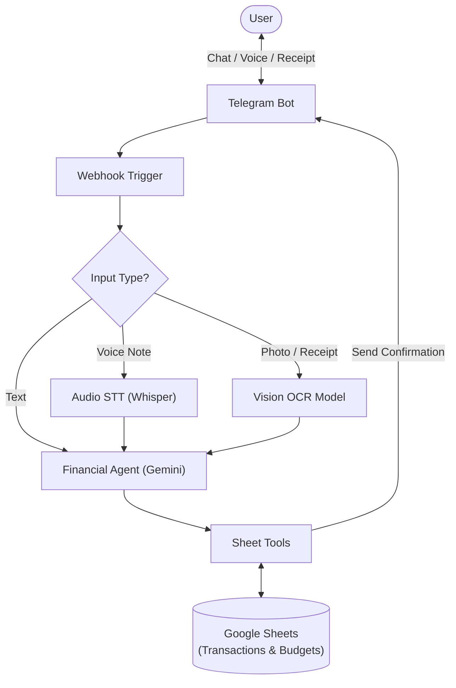
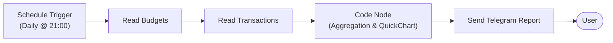
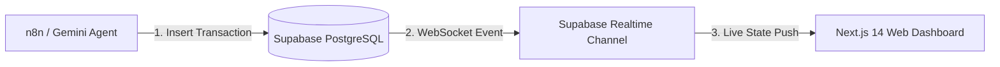

# Ledgerly - AI Financial Copilot (Telegram Bot + n8n + Web Dashboard)

An intelligent, modular personal finance ecosystem powered by **n8n**, **Google Gemini**, **Supabase (PostgreSQL)**, **Google Sheets**, and **Next.js 14**. It automates multi-modal expense tracking, voice/receipt ingestion, dual-database logging, dynamic web analytics sync, and delivers automated scheduled financial health reports directly to your Telegram.

## Key Features

- **Multi-Modal Input Support (Sub-Workflow):**
  - **Text:** Natural language message logging (e.g., *"Beli makan 25rb"*).
  - **Voice Notes:** Automatic speech-to-text audio transcription.
  - **Receipts / Photos:** OCR image analysis to extract amounts and descriptions automatically.

- **AI Financial Agent Core:**
  - Standardized transaction normalization (`income` vs `expense`, category mapping, dynamic timestamping).
  - Multi-tool architecture with Google Sheets database integration and custom calculations.

- **Dynamic Budgeting & Overspending Alerts:**
  - Real-time comparison between current spending and monthly category limits (`budgets` sheet).
  - Visual status badges (` Safe`, ` Warning 80%`, ` Overbudget 100%+`).

-  **Real-Time Web Synchronization:**
   - Instant WebSocket payload pushes from Supabase database writes directly to the **Next.js 14 Web Dashboard**.

- **Proactive Scheduled Reporting:**
  - Automated daily & monthly financial wrap-ups via cron triggers.
  - Zero-LLM cost data aggregation using optimized JavaScript code nodes.
  - Dynamic visual doughnut chart generation powered by QuickChart.

## Tech Stack & Architecture

- **Orchestration:** [n8n](https://n8n.io/) (Modular Main & Sub-workflows)
- **AI Brain:** Google Gemini Chat Model & Vision OCR (LangChain Node)
- **Primary Relational DB:** Supabase (PostgreSQL + Realtime WebSockets)
- **Secondary Backup DB:** Google Sheets API
- **Web Frontend:** Next.js 14 (App Router), Tailwind CSS, TypeScript
- **Interface:** Telegram Bot API
- **Visualization:** QuickChart.io (Bot Reports) & React Components (Web Dashboard)

---

## System Architecture
### 1. Interactive Transaction & Ingestion Flow


### 2. Automated Scheduled Reporting Flow


### 3. Real-Time Web Synchronization Flow (Next.js + Supabase)


### 4. Project Structure 
```
Ledgerly/
├── Workflows/          # n8n workflow JSON files (AI logic & routing)
├── docker-compose.yaml # n8n container orchestration (Port 5678)
├── .env.example        # Environment variables template
├── README.md           # Project documentation
└── expense-tracker/    # Next.js 14 Web Dashboard (Frontend)
```

## 🚀 Getting Started

### 1. Prerequisites
* Docker & Docker Compose installed on your system

* Node.js (v18+) & npm installed

* Telegram Bot Token from @BotFather

* Google Gemini API Key

* Google Cloud Console Service Account (with Google Sheets API enabled)

* Supabase Project URL & Service Role / Anon Keys

---

### 2. Environment Setup
Clone the repository and set up your environment variables:

```bash
git clone [https://github.com/gregoryadrs-alt/Ledgerly.git](https://github.com/gregoryadrs-alt/Ledgerly.git)
cd Ledgerly
cp .env.example .env
```
Open .env and fill in your actual credentials, chat ID, and public webhook URL.

3. Database Setup

A. Supabase PostgreSQL (Run via Supabase SQL Editor)
```bash
CREATE TABLE transactions (
  id BIGINT GENERATED BY DEFAULT AS IDENTITY PRIMARY KEY,
  description TEXT NOT NULL,
  amount NUMERIC NOT NULL,
  type TEXT NOT NULL CHECK (type IN ('income', 'expense')),
  category TEXT DEFAULT 'Others',
  payment_method TEXT DEFAULT 'Cash',
  created_at TIMESTAMPTZ DEFAULT NOW()
);

CREATE TABLE goals (
  id BIGINT GENERATED BY DEFAULT AS IDENTITY PRIMARY KEY,
  name TEXT NOT NULL,
  target_amount NUMERIC NOT NULL,
  current_amount NUMERIC DEFAULT 0,
  target_date TEXT,
  created_at TIMESTAMPTZ DEFAULT NOW()
);

ALTER TABLE transactions ENABLE ROW LEVEL SECURITY;
ALTER TABLE goals ENABLE ROW LEVEL SECURITY;

CREATE POLICY "Allow public access on transactions" ON transactions FOR ALL USING (true) WITH CHECK (true);
CREATE POLICY "Allow public access on goals" ON goals FOR ALL USING (true) WITH CHECK (true);
```
B. Google Sheets Backup Setup
Create a Google Spreadsheet with two tabs:

Sheet1 (Transaction Logs): Headers: id, chat_id, type, value, category, payment_method, description, date.

budgets (Monthly Target Limits): Headers: category, monthly_limit.

### 4. Run n8n Instance
Launch your self-hosted n8n container:
```bash
docker compose up 
```


### 5. Import Workflows
Open the n8n web dashboard at http://localhost:5555. Expose the port 5555 (Using ngrok)

Import all JSON workflows from the workflows/ directory:

```bash
Smart Financial Agent - Telegram Vers.json ( Main Workflow / Telegram Ingestion)

Switch - File.json ( Multi-Modal Preprocessor Sub-Workflow)

Financial Agent.json ( Core AI Agent Sub-Workflow)

Daily & Monthly Financial Recap.json ( Scheduled Reporter)
```

Connect your Google Service Account, Telegram credentials, Gemini API key, and Supabase HTTP/Postgres nodes to their respective nodes.

Set the webhook URL on your Telegram bot trigger.

Toggle all workflows to Active / Published!


### 6. Run Web Dashboard (expense-tracker/ Directory)
To launch the interactive Next.js web dashboard:
```bash
cd expense-tracker
npm install
npm run dev

Open http://localhost:3000 in your browser to view your live financial dashboard.
```


